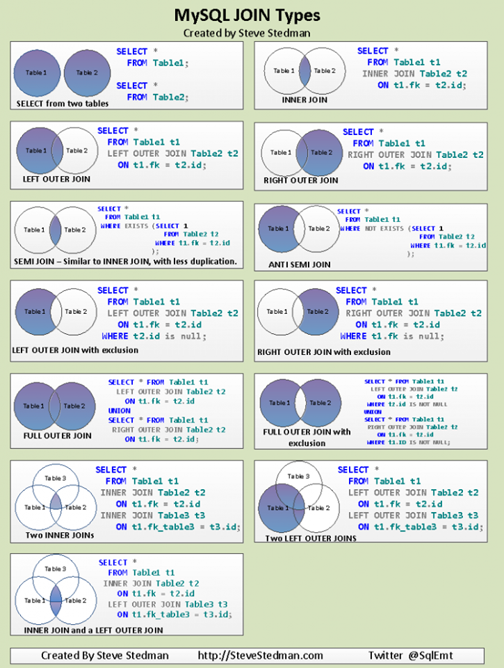

# data_mid_bootcamp_project_regression

Lorem ipsum

## smaller paragraph

### little paragraph

#### tiny paragraph

*this is italic*

**this is bold**

***this is both***

Horizontal line

___
***
---


Here comes a table:

Column 1 | Column 2
---------|----------
Value 1  | Value 2
Value 1  | Value 2
Value 1  | Value 2
Value 1  | Value 2


```python
def my_function(x)
  return x**2
```

Inline code here: `lambda x: x**2`

this is a [link](www.google.com)


